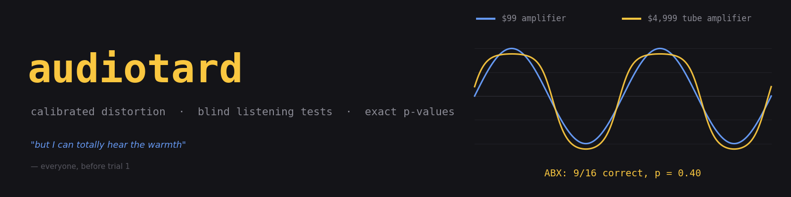

# audiotard &mdash; *because worse sound is better!*

**v0.6.6**



**audiotard** applies *pleasant* distortions to music — tube warmth, second
harmonic, cassette tape, vinyl — with every knob calibrated in physical
units, and then lets you find out, with actual statistics, whether you can
hear any of it.

Most audio-effect tools stop at "sounds warm." Most audiophile arguments
never start measuring. audiotard is the bridge: the same engine that
renders the effect also runs blind listening tests (ABX and adaptive
staircase), so the output isn't an opinion but a sentence like:

> *your H2 detection threshold is −34 dB re the fundamental*

Written in C17. No frameworks. The only external code is two vendored
public-domain single-header decoders (dr_wav, dr_flac); the GUI uses GTK3
and ALSA.

---

## Features

**Waveshaping engine** (oversampled, anti-aliased)
- `tanh` — symmetric saturation, odd harmonics (3rd, 5th, …)
- `tube` — biased tanh, asymmetric, even + odd harmonics
- `h2` — pure 2nd harmonic at an exact dB level you choose
- 2×/4×/8× polyphase oversampling around the nonlinearity
  (Kaiser-windowed sinc, ~96 dB stopband). Without this, a hot tube sim
  on a 15 kHz tone puts an alias just **8 dB** below the fundamental;
  with 8×, it's at **−119 dB**.

**Media simulations**
- **Vinyl**: wow (0.55 Hz = 33 rpm eccentricity) + random drift via a
  cubic-interpolated fractional delay line, pink surface noise, Poisson
  crackle rung through a resonant bandpass, bandwidth limiting.
- **Tape**: wow + flutter, hiss, low-frequency head bump,
  *level-dependent* HF loss (loud passages dull, quiet ones stay open —
  the cassette signature a static EQ can't fake).
- Enabling both chains them **tape → vinyl**, i.e. a record cut from a
  tape master.
- Channel correlation is physical: crackle and wow are shared between
  channels (one groove, one platter), hiss is independent.

**Filters / EQ**
- RBJ-cookbook biquads: peaking, shelves, high-pass, low-pass, band-pass,
  and a band **window** (HP + LP pair — 300–3000 Hz gives the telephone
  band).

**Listening tests** (CLI and GUI)
- **Fixed-level ABX** with an exact binomial test.
- **Adaptive staircase** (2-down-1-up, 2-interval forced choice, step
  6 → 1 dB, threshold = mean of the last 6 reversals) on any of:
  `h2db`, `hiss-db`, `crackle-db`, `wow-cents`, `flutter-cents`, `drive`.
- **Absolute-identification mode** (GUI): each trial plays ONE sound --
  randomly clean or processed -- with no reference to compare against.
  The ear rebases onto a stable distortion within seconds, so comparison
  tests measure a best-case floor; running the same staircase with and
  without references measures your personal *adaptation gap*.
- All test renders are RMS-matched (loudness is the strongest false cue).
- A `--sim` mode replays the procedure with a synthetic listener of known
  threshold, so the staircase itself can be validated after changes.

**GUI** (GTK3 + ALSA)
- Audacity-style waveform: drag to select, click to place the cursor or
  seek during playback.
- In-process playback with play/pause/stop and a live cursor.
- Real-time spectrum (own 4096-pt radix-2 FFT): log or linear frequency,
  dB axis, exponential or moving-average smoothing (done in the power
  domain — averaging dB underweights peaks).
- **Live residual metric** while playing processed audio: the clean
  source is sample-aligned with the processed buffer, so each frame the
  app fits an optimal gain and reports
  `rms(processed − g·clean) / rms(g·clean)` in dB — everything the chain
  added (harmonics, noise, wow sidebands). On a sine passage this equals
  THD+N. The clean spectrum is overlaid so induced components are visible
  as the gap between traces.
- All DSP renders run on a worker thread; the UI never blocks.

---

## Building

Dependencies (Debian/Ubuntu):

```sh
sudo apt install build-essential                  # CLI
sudo apt install libgtk-3-dev libasound2-dev      # GUI
```

The vendored decoders go in `third_party/` (single files, public
domain / MIT-0):

```sh
mkdir -p third_party
curl -sfLo third_party/dr_wav.h  https://raw.githubusercontent.com/mackron/dr_libs/master/dr_wav.h
curl -sfLo third_party/dr_flac.h https://raw.githubusercontent.com/mackron/dr_libs/master/dr_flac.h
```

Then:

```sh
make          # builds ./audiotard (CLI) and ./test_engine
make check    # engine self-test: harmonic levels, calibration, aliasing
make gui      # builds ./audiotard-gui
```

Everything compiles with `-std=c17 -Wall -Wextra -Wpedantic` (the GUI
translation unit drops `-Wpedantic` only because GTK headers aren't
pedantic-clean).

---

## CLI usage

```
audiotard in.(wav|flac) out.wav [options]      # process a file
audiotard abx in.(wav|flac) [options]          # listening test
```

Examples:

```sh
# full cassette treatment, loudness-matched to the input
./audiotard song.flac out.wav --tape --shape tanh --drive 3 --match-rms

# gentle vinyl
./audiotard song.flac out.wav --vinyl --wow-cents 4 --crackle-rate 5

# EQ chain: low shelf, presence cut, air shelf
./audiotard song.flac out.wav --eq ls:120:0.7:2 --eq peak:3000:1.4:-3 --eq hs:9000:0.7:1.5

# ABX: can you hear the tape flutter? 16 trials, binomial p-value
./audiotard abx clip.flac --tape --trials 16 --player "aplay %s"

# measure your 2nd-harmonic detection threshold
./audiotard abx clip.flac --shape h2 --h2db -15 --staircase h2db --player "mpv --really-quiet %s"

# validate the staircase procedure itself with a simulated listener
./audiotard abx clip.wav --shape h2 --h2db -12 --staircase h2db --sim -38 --seed 7
```

Output is 16- or 24-bit WAV with TPDF dither (deterministic seed: same
input + parameters → bit-identical output). FLAC is read, not written —
for a listening-test tool, lossless WAV out avoids an encoder dependency.

Selected options (see `src/main.c` header comment for the full list):

| option | meaning |
|---|---|
| `--shape none\|tanh\|tube\|h2` | waveshaper type |
| `--drive G` | pre-gain into the nonlinearity (dimensionless) |
| `--bias B` | tube asymmetry → even harmonics (dimensionless) |
| `--h2db D` | 2nd-harmonic level, dB re fundamental at file peak |
| `--os L` | oversampling factor 1–32 (default 8) |
| `--wow-cents C`, `--flutter-cents C` | peak pitch deviation |
| `--hiss-db D`, `--crackle-db D`, `--crackle-rate N` | noise levels / tick rate |
| `--hf-loss S` | tape level-dependent treble loss, 0–1 |
| `--eq TYPE:F:Q[:GAIN]` | biquad band (`peak ls hs lp hp bp`), repeatable |
| `--match-rms` | scale output to input RMS |
| `--bits 16\|24`, `--no-dither` | output format |

## GUI usage

```sh
./audiotard-gui [optional-input-file]
```

Load a file, drag a selection on the waveform, and:

- **Play clean / Play processed** audition the selection (processed
  playback shows the live residual metric and the clean-spectrum
  overlay). Without a selection, processed preview is capped at 60 s —
  use *Render to file…* for full-length output.
- The **Chain** tab holds the waveshaper, filters, media sliders, and
  render controls; hover any control for its meaning and units.
- The **Listening test** tab runs ABX or a staircase on the current
  selection (max 30 s) entirely with buttons. During a staircase the
  current level is deliberately hidden; the threshold appears at the end.

Tip: a familiar 5–15 s loop makes far better test material than a whole
song. Sustained piano is merciless for wow/flutter; dense mixes hide
almost everything.

---

## How the numbers are kept honest

The project's rule is that every claim gets measured, mostly by
independent code (Python analysis of rendered files, or simulated
listeners), not by the DSP grading its own homework:

| claim | measured |
|---|---|
| H2 calibrated to −30 dB | −30.00 dB through the full file pipeline |
| oversampling kills aliasing | alias −7.95 dB (off) → −119 dB (8×) |
| EQ `peak:1000:1:6` | +6.00 dB at 1 kHz, +0.03 off-band |
| wow set to 20 cents | ±20.2 cents measured pitch deviation |
| hiss set to −60 dBFS | −60.00 dBFS measured RMS |
| staircase recovers a known threshold | −25/−38/−50 dB sims → −25.7/−38.2/−49.7 |
| residual metric | −20/−30/−40/−50 dB injected → −19.99/−29.99/−39.98/−49.88 read back |

The residual metric earned its keep immediately: building it exposed a
sub-sample group-delay misalignment in the oversampler and audible-floor
phase lead in the DC blocker, both since fixed.

## Project layout

```
src/
  engine.c/h      oversampled waveshaping core (Kaiser FIR, polyphase)
  effects.c/h     biquads, fractional-delay wow/flutter, noise, vinyl/tape
  chain.c/h       the effect chain: params, CLI parsing, renderer,
                  staircase plumbing, binomial test
  audio_io.c/h    WAV/FLAC read, dithered 16/24-bit WAV write
  main.c          CLI file processor + subcommand dispatch
  abx.c           terminal ABX / staircase harness
  fft.c/h         radix-2 FFT + Hann spectrum (GUI display)
  playback.c/h    ALSA playback thread: pause, seek, audible position
  gui.c           GTK3 application
  test_engine.c   self-test (synthesized sines + Goertzel measurement)
third_party/
  dr_wav.h, dr_flac.h   vendored decoders (mackron/dr_libs)
Makefile
```

## WebAssembly (run it in a browser)

The DSP core compiles to WebAssembly with plain clang + wasi-libc -- no
emscripten toolchain needed:

```sh
sudo apt install clang lld wasi-libc libclang-rt-18-dev-wasm32
sh wasm/build.sh                      # -> wasm/audiotard.wasm (~240 KB)
cd wasm && python3 -m http.server     # then open http://localhost:8000
```

`wasm/index.html` is a self-contained front end: load any audio file,
set the chain, play clean vs processed, and run a 16-trial ABX with an
exact binomial p-value -- entirely client-side, nothing uploaded. The
same `chain_render` that powers the CLI and GTK app does the rendering,
so browser results are bit-comparable with native ones. (The GTK GUI
itself does not port; a fuller web UI would reimplement it against
canvas/Web Audio on top of this module.)

## Notes and limitations

- Linux-first: the GUI's audio path is ALSA (PipeWire and PulseAudio
  expose it). The CLI is portable POSIX.
- Processing is offline whole-buffer by design — simple, exact, and
  time-aligned for null tests. There is no streaming/plugin mode.
- True THD is only defined for sine input; on program material the
  residual metric reports total induced distortion + noise, which is the
  honest generalization.
- Headless machines: set `AUDIOTARD_ALSA_DEV=null` to run the GUI with a
  real-time-paced silent sink.

## Squashed bugs (full transparency)

audiotard's authority rests on one claim: *the only audible difference
between clean and processed is the distortion you dialed in.* Any defect
that violates that claim biases results, so this project publishes its
failure history. Bugs marked **[integrity]** could have contaminated
listening-test results obtained before the fix -- re-run anything that
mattered.

- **Live-stream gain pumping** [integrity, fixed 0.6.5]. The output
  headroom trim (correct for whole-file renders) was applied
  independently to every streaming block, producing 1-3 dB level steps
  at block seams on hot masters -- loudness being the strongest false
  cue there is. Caught by reading the per-block trim values in stderr:
  their variance *was* the pumping. Fixed by exempting streaming
  renders and folding a constant -3 dB headroom into the stream gain,
  applied identically to clean and processed.

- **Digital clipping on hot masters** [integrity, fixed 0.6.0].
  Commercial masters peak at -0.1 dBFS; the h2 shape (x + a*x^2 > 1 at
  peaks), added noise, and RMS matching pushed renders past full scale
  -- a test file measured 11,179 hard-clipped samples. Reported by a
  reviewer. Fixed with a transparent output trim plus loudness
  re-equalization in ABX preparation so the trim itself cannot become
  a cue.

- **Staircase confounds** [integrity]. A threshold session varied one
  parameter but rendered the entire enabled chain: a hiss staircase
  with vinyl on carried crackle 15.5 dB *above the signal* -- the
  measured threshold was for the loudest confound, not the named
  parameter. Caught by a listener reporting the stimulus "noisier than
  nominal", confirmed by measurement. Fixed: staircases now isolate
  their parameter (everything else disabled for the session).

- **Media delay-line latency** [integrity]. The wow/flutter fractional
  delay line carried ~8 samples of uncompensated constant latency, so
  every media render was time-shifted against the source -- inaudible,
  but it inflated the residual metric from the true value to a -20 dB
  floor. Found while measuring the staircase fix; fixed with exact
  integer-delay compensation (isolated hiss at -60 dBFS now reads
  -59.9).

- **Oversampler group delay and DC-blocker phase**. Building the
  residual metric exposed two engine subtleties: FIR length did not
  guarantee integer group delay at base rate (sub-sample misalignment,
  -41 dB null floor), and the 5 Hz DC blocker's phase lead put a
  -46 dB floor under every null test. Fixed (tap-count alignment;
  corner moved to 0.5 Hz); known-distortion injections now read back
  within 0.12 dB across -20..-50 dB.

- **Tube normalization blow-up**. Normalizing the tube shape to unity
  small-signal gain divides by g*sech^2(g*b), which collapses at high
  drive*bias -- a x326 gain explosion at extreme settings. Caught the
  moment the transfer-view panel rendered it off-scale. Both shapes
  are now span-normalized: bounded output for any knob combination,
  harmonic profile unchanged.

- **Browser: silence from a type mismatch** [0.6.0-0.6.2]. A patch
  converting the streaming worker's audio buffer to Float32 silently
  failed to apply (its search anchor missed), so the worker
  reinterpreted Float32 samples through a Float64 view: denormal
  garbage, i.e. silence, with all scheduling still running. The
  toolchain compounded it by "verifying" a hand-written replica of the
  worker instead of the shipped file. Fixed in 0.6.3; process fixed
  too: patches now assert their anchors, verification executes the
  actual artifact, and a version gate blocks inconsistent releases.

- **Browser: render starvation** [fixed 0.6.4]. Each 93 ms block
  dragged 371 ms of pre-roll -- a 5.25x work multiplier that pushed
  throughput to ~1x realtime on modest CPUs: playback consumed its
  lookahead and stopped. Fixed with pre-roll adapted to the enabled
  chain, larger blocks, a SIMD build, and an explicit "can't keep up"
  notice instead of silent stalling (measured: shaper-only now ~11x
  realtime).

- Assorted honest embarrassments: a synchronous render freezing the
  GTK UI (moved to a worker thread); a GTK shutdown race spraying
  Gtk-CRITICAL assertions (teardown ordered; proven clean under
  G_DEBUG=fatal-criticals); the browser's first block never being
  requested (pump bootstrap deadlock); canvases shrinking to zero at
  <100% zoom (a devicePixelRatio feedback loop); deploys silently
  skipping recompilation because tar restored archive timestamps
  (deploy now extracts with fresh mtimes and *verifies the built
  binary's version*).

Most of these were found by the tool's own instrumentation pointed at
itself -- the residual metric, the null test, the transfer view, a
reviewer's ears. That is the method the project sells; it would be
strange not to use it.

## License

audiotard is free software: GNU General Public License, version 3 or
later. See `COPYING` for the full text. Copyright (C) 2026 Mico.

The vendored decoders in `third_party/` (`dr_wav.h`, `dr_flac.h`) are
by David Reid (mackron/dr_libs) and keep their own license (public
domain / MIT-0), which is GPL-compatible.
